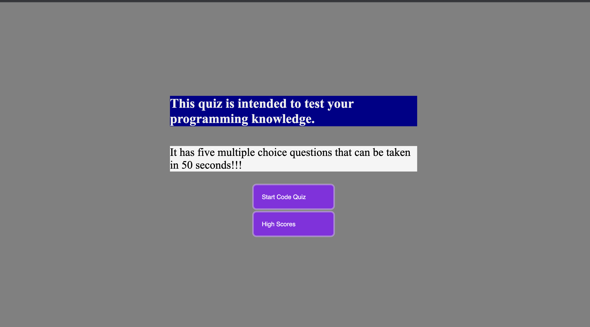

# Web APIs: Code Quiz

## Table Of Contents

- [ToDo](#ToDo)

- [User-Story](#User-Story)

- [Acceptance Criteria](#Acceptance-Criteria)

- [Mock-Up](#Mock-Up)

- [Live-Deployed-App](#Live-Deployed-App)


### ToDo

```
At some point in my journey to become a full-stack web developer, I will be asked to complete a coding assessment&mdash;perhaps as part of an interview process. A typical coding assessment includes both multiple-choice questions and interactive coding challenges. 

To help familiarize my self with these tests and allow my self to use some of the skills I have learned I wanted do a new project that is timed coding quiz with multiple-choice questions. This app will run in the browser and will feature dynamically updated HTML and CSS powered by JavaScript code that I wrote. It will have a clean, polished, and responsive user interface.
```

### User-Story

```
AS A coding boot camp student
I WANT to take a timed quiz on JavaScript fundamentals that stores high scores
SO THAT I can gauge my progress compared to my peers
```

### Acceptance-Criteria

```
GIVEN I am taking a code quiz
WHEN I click the start button
THEN a timer starts and I am presented with a question
WHEN I answer a question
THEN I am presented with another question
WHEN I answer a question incorrectly
THEN time is subtracted from the clock
WHEN all questions are answered or the timer reaches 0
THEN the game is over
WHEN the game is over
THEN I can save my initials and my score
```

### Mock-Up

```
The following picture demonstrates the application functionality:
A user clicks through an interactive coding quiz, then enters initials to save the high score before resetting and starting over
```



